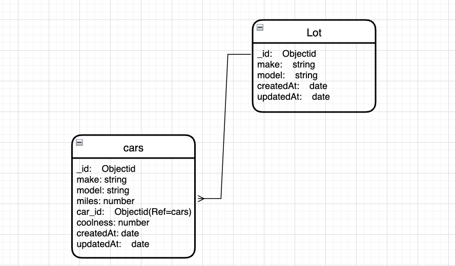
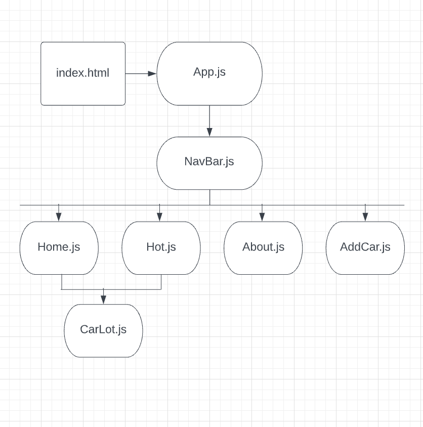
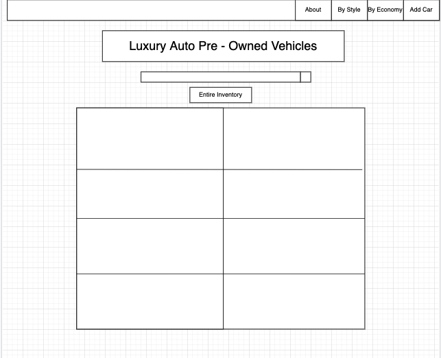
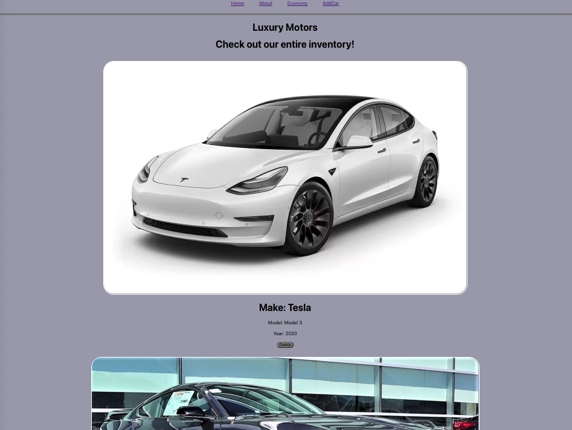

# Used Cars

### By: Bryan Sanchez

---

- [Trello](https://trello.com/b/65b8L5kQ/u2projectusedcars)
- [GitHub](https://github.com/Bryvn1xx)

---

## 

# Getting Started
### npm i
### npm i react-router-dom
### node seed/carsSeed.js

## Description:

#### In this project i will create a webpage to display the used cars at my lot. I will create this using React & MongoDB, i will have te ability to view, update, add, and delete cars on my page depending on my inventory. This webpage will inspire those who are stuck on what new car they would like to buy. Also it is a list of cars i personally love!

## Technology Used:
### React
### mongoDB
### Express
### CSS

---

### ERD

## 

### Component Hierarchy Diagram

## 

### Final Product Mock-Up

## 

# 

Future Update:

### - add search functionality

### - add filtering through cars

### - add links to kbb for cars

---

Credits:

[Class_Wiki](https://github.com/SEI-R-2-22/class_wiki)
[FlexboxFroggy](https://flexboxfroggy.com/)
[MongoDB Docs](https://www.mongodb.com/docs/)
